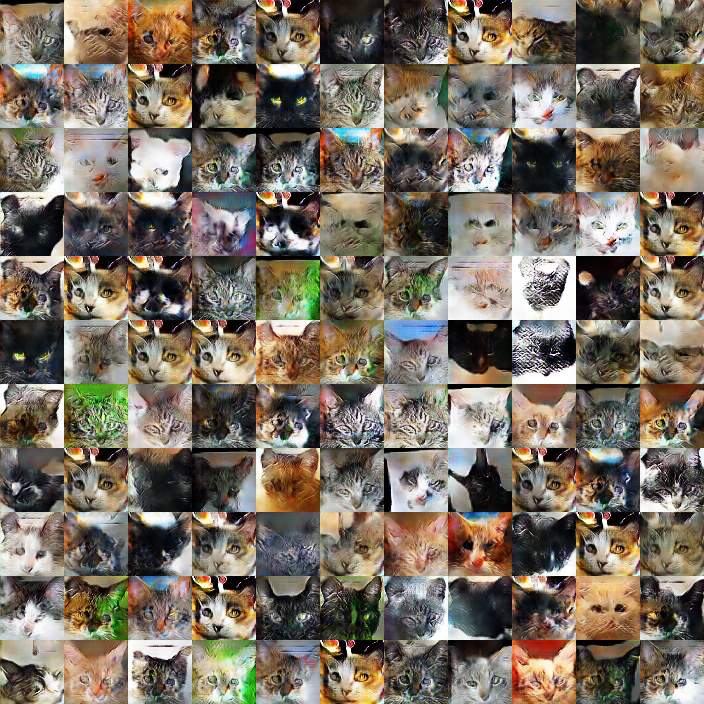

# GAN for image generation

A GAN to generate images of different sizes by training on given images.

### Getting started
git clone the project

### Prerequisites
1. Probably a GPU or else it will be extremely slow.
1. Tensorflow-gpu installed on your computer.

### Sample Running commands

#### Running on the cat data set
`--data_set=cat --batch_size=128 --creativity=200 --filter_depth=64 --learning_rate=0.002 --num_layers=6 --sub_dir=Cat_layer_6_200_creativity --save=500`\
Note that I decreased the learning rate by a factor of 10 after the output 
images are relatively similar

#### Running on the cifar-10 dataset
`python main.py`

#### sample results

#### Dataset used
https://archive.org/details/CAT_DATASET
https://www.cs.toronto.edu/~kriz/cifar.html
